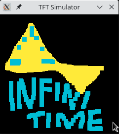
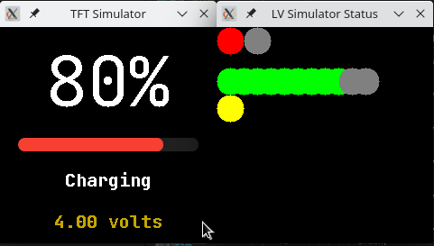

# InfiniSim

- ommiting restructures restructures of the InfiniSim project, it's confusing enough on its own

---

## The beginnings

- I've got a PineTime, and I'm loving it!
- I want to hack on the PineTime, but I'm afraid I'm destroying it
- Let's write a Simulator to check my changes before killing my beloved watch

And so the journey began

---

## LVGL

https://github.com/lvgl/lvgl

> **About**
> Powerful and easy-to-use embedded GUI library with many widgets, advanced visual effects (opacity, antialiasing, animations) and low memory requirements (16K RAM, 64K Flash).

---

## lv_sim

Need LVGL simulator ... found one: [lvgl/lv_sim_eclipse_sdl ](https://github.com/lvgl/lv_sim_eclipse_sdl)

> **About**
> PC simulator project for LVGL embedded GUI Library. Recommended on Linux and Mac.

---

## First Screen

- Something easy
- little dependencies
- `Paddle.h`!

```cpp
Paddle(DisplayApp* app, Pinetime::Components::LittleVgl& lvgl);
```

Copy depedencies and comment out everything I haven't handled yet

```
src/displayapp/DisplayApp.h    -> sim/displayapp/DisplayApp.h
src/displayapp/DisplayApp.cpp  -> sim/displayapp/DisplayApp.cpp
src/displayapp/LittleVGL.h     -> sim/displayapp/LittleVGL.h
src/displayapp/LittleVGL.cpp   -> sim/displayapp/LittleVGL.cpp
```

---

## 2021-11-13 Paddle


---

## 2021-11-03 Paint, Fonts and Swipes

  

---

## 2021-11-07 Metronome and the Motor


---

## 2021-11-15 BatteryInfo


---

## 2021-11-18 Found my Simulated Charger



---

## 2021-11-28 There shall be (Flash-) Light

 

---

## Switching Screens, the hard-coded way

- comment current screen define
- uncomment screen to show
- recompile

```cpp
// uncomment the screen to use, disable others
#define LV_Paddle
//#define LV_InfiniPaint
//#define LV_Twos
// end compile time selection of screen
#if defined(LV_Paddle)
  Pinetime::Applications::Screens::Paddle screen(&app, lvgl);
#endif
#if defined(LV_InfiniPaint)
  Pinetime::Applications::Screens::InfiniPaint screen(&app, lvgl);
#endif
#if defined(LV_Twos)
  Pinetime::Applications::Screens::Twos screen(&app);
#endif
```

---

## 2021-11-30 WatchFaces coming together

  

---

## 2021-12-01 Switching Screens: runtime switching

- hit one of the number keys to switch screen

```cpp
void switch_to_screen(uint8_t screen_idx)
{
  screen.reset();
  if (screen_idx == 1) {
    screen.reset(WatchFaceDigitalScreen());
  }
  else if (screen_idx == 2) {
    screen.reset(WatchFaceAnalogScreen());
  }
  else if (screen_idx == 3) {
    screen.reset(PineTimeStyleScreen());
  }
  else if (screen_idx == 4) {
    screen.reset(PaddleScreen());
  }
  else if (screen_idx == 5) {
    screen.reset(TwosScreen());
  }
  else if (screen_idx == 6) {
    screen.reset(MetronomeScreen());
  }
  else if (screen_idx == 7) {
    screen.reset(MeterScreen());
  }
  else if (screen_idx == 8) {
    screen.reset(BatteryInfoScreen());
  }
  else if (screen_idx == 9) {
    screen.reset(FlashLightScreen());
  }
}
```

---

## 2021-12-02 It's Time! I knew it!

  

- Use system time to set simulator time
- notifications can be triggered pressing `n` and cleared pressing `N`

---

## Emscripten WebAssembly

2022-02-24: https://github.com/InfiniTimeOrg/InfiniSim/pull/6

## InfiniTime Structure

PR: https://github.com/InfiniTimeOrg/InfiniTime/pull/1015

https://docs.infinitime.io/en/documentation-reorganization-architecture/developer-documentation/index.html
